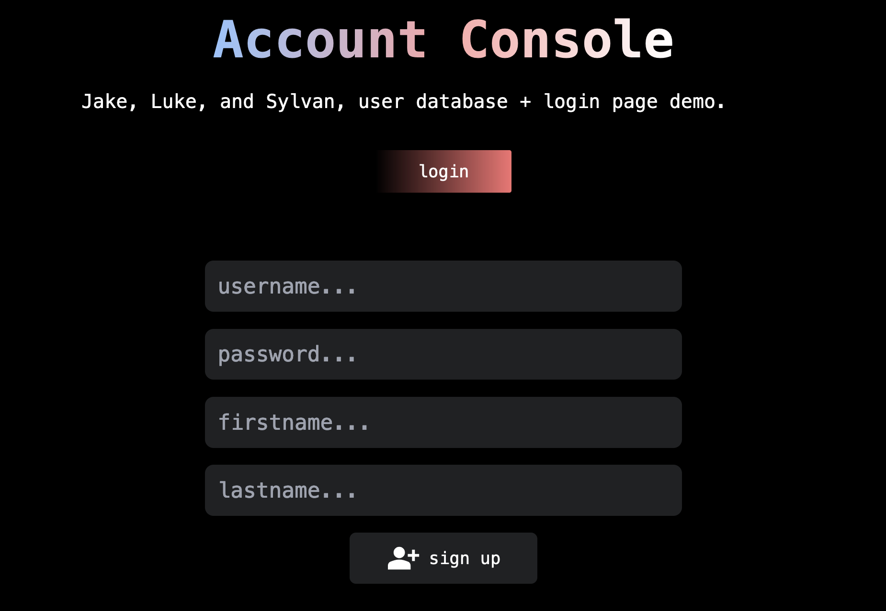

# Login Page Demo 
Sylvan, Luke, Greek guy (Jake), Login Demo Project for an unspecified class at UVM. MySQL database, Svelte-kit frontend, and Flask backend. This project also includes a build script because running all processes by hand is cumbersome. Running the project will differ slightly platform to platform.  

--- 

# Requirments
In order to run the front end you need node and npm installed locally. Flask server will require installing several packages listed at the top of the app.py file. In some cases a virtual environment is necessary when installing these dependencies. A local SQL database is also required, for example mySQL or mariaDB. 

I mostly wrote the frontend, but helped out a bit with the backend at some points. Luke and Jake handled the database and backend. 

### Demo video:
[here](https://youtu.be/BFwRreUEM5k)
